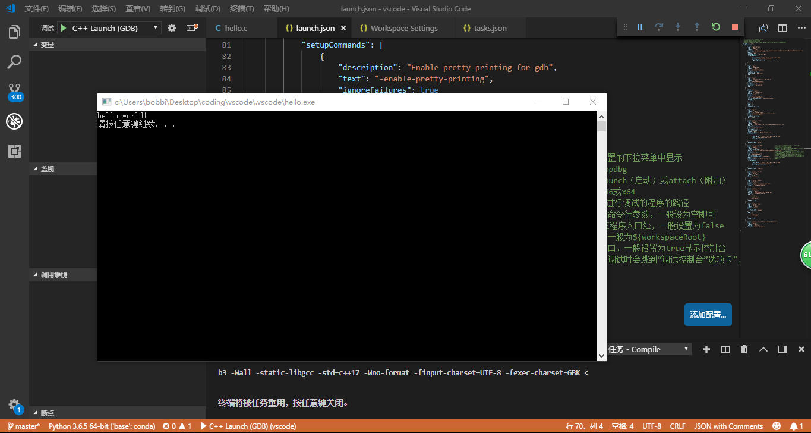

#vs code c++ 环境配置
>zzw的头发又少了……
##前言
<font size = 4 face="楷体">
&#160;&#160;&#160;&#160;vs code是一个开源的好东西，我已经把几乎所有的东西都开始用vs code来写了，比如perl，比如c++，比如python，再比如写出这篇文字的markdown等等……</br>
</font>
<font size = 4 face="楷体">
&#160;&#160;&#160;&#160;但，开源也有自由的代价，比如说我的c++就配置的无比艰难曲折。我的ubuntu上，c++异常好配置，但到了我的windows系统，这个c++的配置，网上我就没遇到一个好用的代码。而且还经常今天配置完明天就又莫名其妙不好用了。今天被逼无奈，自己把launch.json和tasks.json给重写了。今天时间不多，简单share一下这段代码与心得。//一旦以后哪天就又坏了呢/捂脸。</br>
</font>


##launch.json的重写
<font size = 4 face="楷体">
&#160;&#160;&#160;&#160;在这段程序中主要参考了网上的注释以及代码思路来进行的编写.参考的链接为：

<https://blog.csdn.net/c_duoduo/article/details/51615381>
&#160;&#160;&#160;&#160;其中重点需要注意的是program、miDebuggerPath与preLaunchTask。</br>
&#160;&#160;&#160;&#160;program使用来进行使用的编译完成的文件exe的调用。.exe前的内容需要与自己写的task生成的内容相匹配，在task的"args"那一栏中，查看自己编译的是啥。我用的是${fileBasenameNoExtension}.exe，与自己现在的文件名相同。</br>
&#160;&#160;&#160;&#160;miDebuggerPath这一栏是自己使用的编译器的位置与调用的编译exe名字。这里面用的是mingw提供的gnu来编译，提供的是mingw的gdb.exe路径。提示：需要注意自己的编译是x64还是x86，调用的gdb别搞错了。因为使用的是gdb编译，故在task中使用的是gdb编译的语句（这是后话）。
&#160;&#160;&#160;&#160;preLaunchTask是先运行task来进行编译。此编译是自动调用task中对应lable的那一部分编译。
```JavaScript
{
    {
            "name": "C++ Launch (GDB)",                 // 配置名称，将会在启动配置的下拉菜单中显示，在debug中找到对应的这个名字的编译器启动，就可以调用本段代码。你也可以改成任意名字。
            "type": "cppdbg",                           // 配置类型，这里只能为cppdbg，无需修改
            "request": "launch",                        // 请求配置类型，可以为launch（启动）或attach（附加），具体区别见下面附加内容
            "targetArchitecture": "x64",                // 生成目标架构，一般为x86或x64
            "program": "${fileDirname}/${fileBasenameNoExtension}.exe", // 将要进行调试的程序的路径,.exe前面的那个一定要对应task生成的！
            "args": [],                                 // 程序调试时传递给程序的命令行参数，一般设为空即可
            "stopAtEntry": false,                       // 设为true时程序将暂停在程序入口处，一般设置为false
            "cwd": "${workspaceRoot}",                  // 调试程序时的工作目录，一般为${workspaceRoot}
            "externalConsole": true,                    // 调试时是否显示控制台窗口，一般设置为true显示控制台
            "internalConsoleOptions": "neverOpen",      // 如果不设为neverOpen，调试时会跳到“调试控制台”选项卡",
            "MIMode": "gdb",                            // 指定连接的调试器
            "miDebuggerPath": "C:/MinGW/bin/gdb.exe", // 调试器路径，每个人都不一样
            "setupCommands": [
                {
                    "description": "Enable pretty-printing for GDB",
                    "text": "-enable-pretty-printing",
                    "ignoreFailures": false
                }
            ],
            "preLaunchTask": "Compile" //此处的文件名与task中的文件名lable相对应，表示调度task中的...先进行预编译。
        },
}
```
</fonk>

##task.json的重写
<font size = 4 face="楷体">
&#160;&#160;&#160;&#160;task.json主要是预编译的作用。提前写好本来要在cmd中写的编译语句，存好，等文件来了就自动输进去编译。本段代码的注释参考链接为：

<https://blog.csdn.net/feynman1999/article/details/79437524>
&#160;&#160;&#160;&#160;主要的需要更改的注意的内容：
1.  使用的编译语句命令需要和自己选择的command相匹配。
2.  注意将args里的关键词分开引用，不然输出的会是一串字符串，比如
```javascript
"-o",
"${fileDirname}/${fileBasenameNoExtension}.exe",
```
不能写成
```javascript
"-o ${fileDirname}/${fileBasenameNoExtension}.exe",
```
&#160;&#160;&#160;&#160;有的人好像也不会报错，但是我这边就会报错，在自动进行的编译中对电脑输入的指令为：带双引号的 "-o \${fileDirname}/${fileBasenameNoExtension}.exe" 。
3.  暂时想不起来，以后再更~
&#160;&#160;&#160;&#160;代码在此，尽管拿去：

```javascript
{
            "label": "Compile",
            "command": "g++",
            "args": [
                "-g",
                "${file}",   //指定编译源代码文件                    
                "-o",
                "${fileDirname}/${fileBasenameNoExtension}.exe", // 指定输出文件名，不加该参数则默认输出a.exe
                "-ggdb3",   // 生成和调试有关的信息
                "-Wall",    // 开启额外警告
                "-static-libgcc",   // 静态链接
                "-std=c++17",       // 使用最新的c++17标准
                "-Wno-format",
                "-finput-charset=UTF-8",//输入编译器文本编码 默认为UTF-8
                "-fexec-charset=GBK"//编译器输出文本编码 自行选择
            ],

            "type": "shell",

            "group": {
                "kind": "build",
                "isDefault": true
            },

            "presentation": {
                "echo": true,
                "reveal": "always", // 在“终端”中显示编译信息的策略，可以为always，silent，never
                 "focus": false,
                 "panel": "shared" // 不同的文件的编译信息共享一个终端面板
            },

            "problemMatcher": {
                "owner": "cpp",
                "fileLocation": [
                    "relative", "\\"
                ],
                "pattern": {
                    "regexp": "^(.*):(\\d+):(\\d+):\\s+(warning|error):\\s+(.*)$",
                    "file": 1,
                    "line": 2,
                    "column": 3,
                    "severity": 4,
                    "message": 5
                }
            }
        }
```
</fonk>
##附加内容
1. launch与attach区别 参考链接为：
    <https://www.cnblogs.com/y896926473/articles/5657434.html>
    launch实际上是启动一个node执行指定代码，同时可以在vscode里面打断点调试。以上述配置为例，实际执行的命令为
    ```
    node --debug-brk=30001 --nolazy --es_staging --harmony-proxies out/bootstrap.js
    ```
    端口号是随机的，vscode能打断点调试是因为他内部监听了这个端口，并与node通讯实现调试。
    attach就是监听的任务。例如 其他程序 启动了一个node应用并使用了—debug-brk参数开启了5858端口使程序暂停在了第一行。此时启动attach任务，就可以监听到这个端口，并在 vscode里面 调试这个node应用了。
2. mingw使用原因很简单，在Linux与widows上兼容性好。MinGW，是Minimalist GNUfor Windows的缩写。它是一个可自由使用和自由发布的Windows特定头文件和使用GNU工具集导入库的集合，允许你在GNU/Linux和Windows平台生成本地的Windows程序而不需要第三方C运行时（C Runtime）库。MinGW 是一组包含文件和端口库，其功能是允许控制台模式的程序使用微软的标准C运行时（C Runtime）库（MSVCRT.DLL）,该库在所有的 NT OS 上有效，在所有的 Windows 95发行版以上的 Windows OS 有效，使用基本运行时，你可以使用 GCC 写控制台模式的符合美国标准化组织（ANSI）程序，可以使用微软提供的 C 运行时（C Runtime）扩展，与基本运行时相结合，就可以有充分的权利既使用 CRT（C Runtime）又使用 WindowsAPI功能。参考链接为[百度百科-mingw][1]。

[1]:https://baike.baidu.com/item/mingw/1777782?fr=aladdin